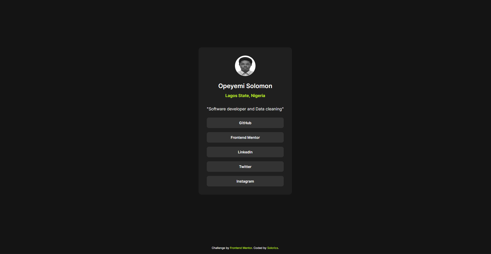
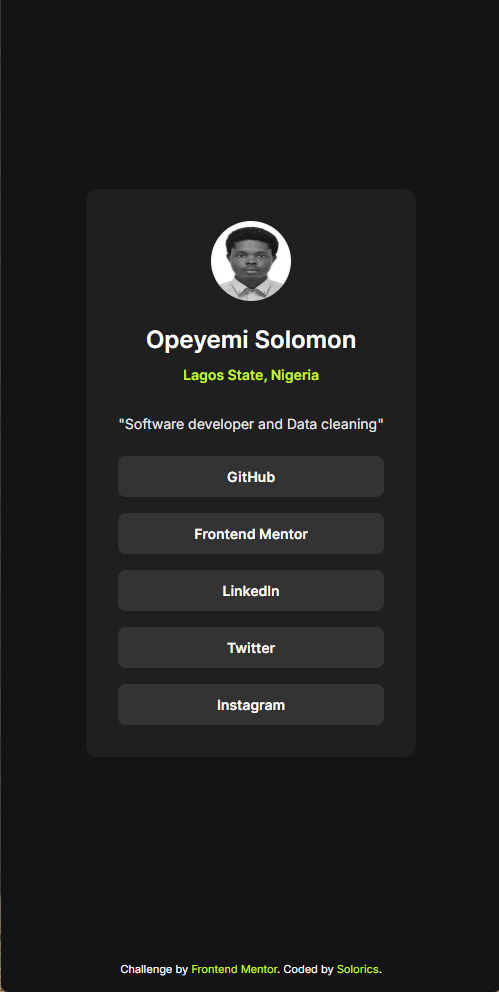

# Frontend Mentor - Social Links Profile Solution

This is my solution to the [Social links profile challenge on Frontend Mentor](https://www.frontendmentor.io/challenges/social-links-profile-UG32l9m6dQ).

## Table of contents

- [Overview](#overview)
  - [The challenge](#the-challenge)
  - [Screenshot](#screenshot)
  - [Links](#links)
- [My process](#my-process)
  - [Built with](#built-with)
  - [What I learned](#what-i-learned)
  - [Continued development](#continued-development)
- [Author](#author)

---

## Overview

### The challenge

Users should be able to:

- See hover and focus states for all interactive elements on the page

### Screenshot




### Links

- Solution URL: [GitHub Repository](https://github.com/solotechrics/social-links-profile)
- Live Site URL: *(coming soon — will update after deployment)*

---

## My process

### Built with

- Semantic HTML5
- CSS custom properties
- Flexbox
- Google Fonts (Inter)
- Mobile-first workflow
- Separated CSS architecture (`variables.css`, `base.css`, `style.css`)

### What I learned

This project was my first time separating CSS into multiple files — `variables.css` for design tokens, `base.css` for resets, and `style.css` for component styles. I learned that the `variables.css` link must come first in the HTML `<head>` so the custom properties are available when the other files load.

I also practiced smooth hover transitions on links styled as buttons:

```css
.social-links a {
    transition: background-color 0.3s ease, color 0.3s ease;
}

.social-links a:hover,
.social-links a:focus-visible {
    background-color: var(--hover-color);
    color: #111111;
}
```

Adding `:focus-visible` alongside `:hover` ensures keyboard users also see the active state — satisfying both the hover and focus requirements of the challenge.

### Continued development

- Continue using separated CSS file architecture on future projects
- Explore CSS transitions more deeply for smoother UI interactions
- Move on to more complex layout challenges involving grid and multi-section pages

---

## Author

- GitHub - [@solotechrics](https://github.com/solotechrics)
- Frontend Mentor - [@solotechrics](https://www.frontendmentor.io/profile/solotechrics)
- Twitter - [@Solorics_](https://x.com/Solorics_)